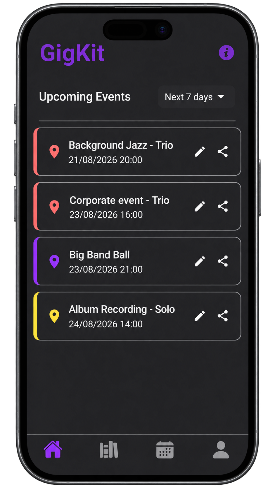
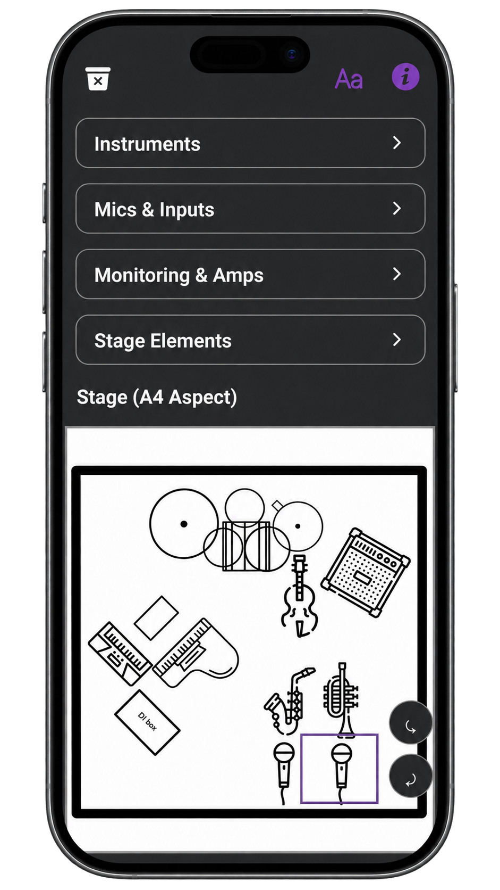
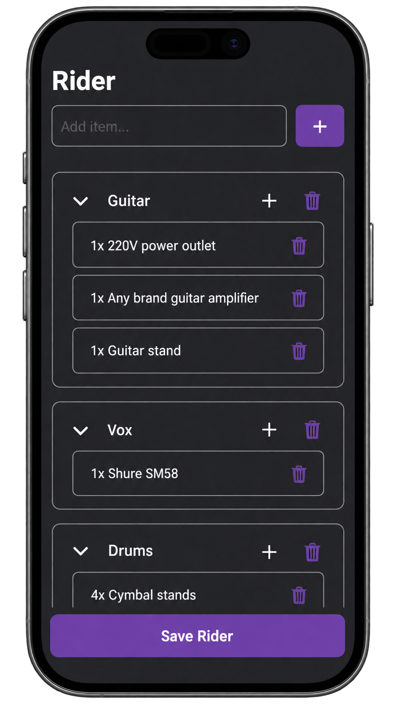
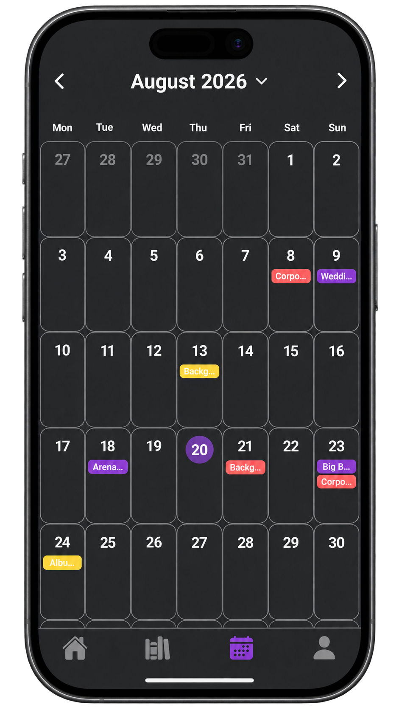
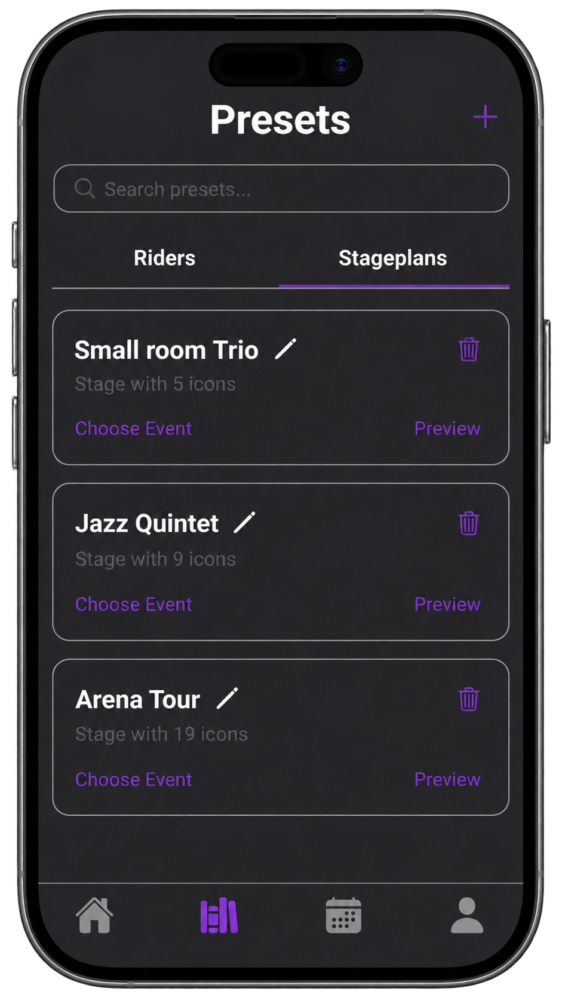
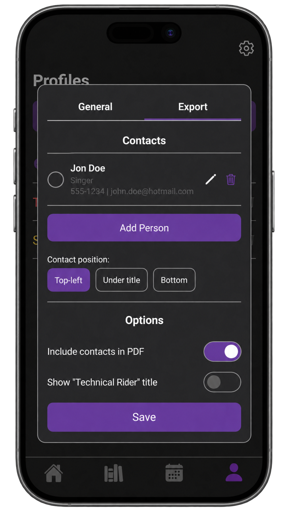
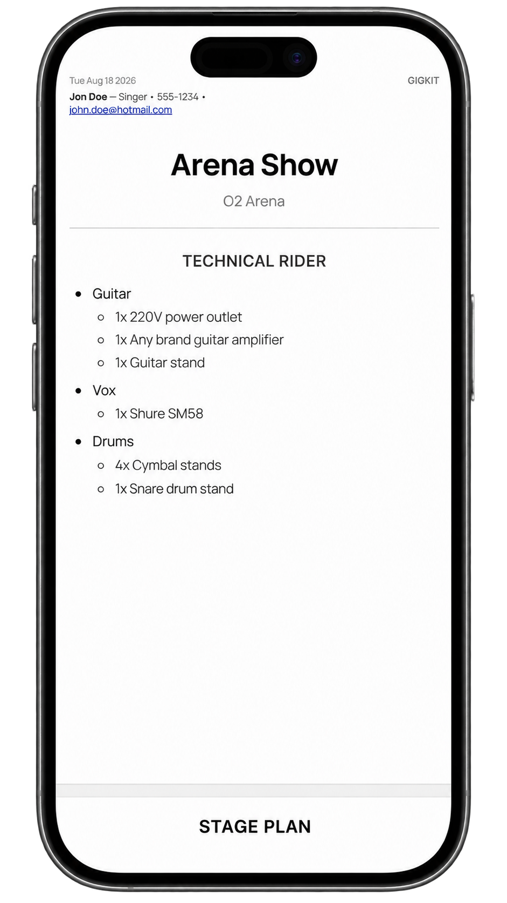

# GigKit

GigKit is a mobile application for musicians to manage gigs, event details, stage plans, technical riders, and other gig-related workflows in one place.

   
   
   

## Features

- Gig/event management
- Custom Calendar
- Stage plan editor
- Technical rider editor
- Reusable presets
- PDF export
- Notifications
- User profiles
- Light/dark theme

## App Preview

  
  

   
   

## Tech Stack

- React Native
- Expo
- TypeScript
- Expo Router
- AsyncStorage
- Firebase

## My Contributions

GigKit was developed by a three-person team. I originated the product concept and took the lead in coordinating the project from initial idea through development and release.

My primary contributions included:

- Conceiving the original product idea and defining the core feature set
- Leading the three-person development team and coordinating implementation priorities
- Designing and implementing the home screen and core navigation
- Developing the custom calendar and event-management experience
- Building the technical rider editor and reusable preset system
- Implementing PDF generation and export functionality
- Contributing to the stage plan editor and its interaction design
- Helping shape the overall UI/UX and product direction

## Running Locally

### Prerequisites

- Node.js and npm
- Expo Go installed on a mobile device

### Setup

1. Clone the repository
2. Run `npm install`
3. Run `npx expo start`
4. Press `s` to switch to Expo Go
5. Scan the QR code with Expo Go to launch the app

## Cloud sync

GigKit contains an experimental Firebase-based cloud layer intended for future functionality such as multi-device synchronization and sharing between band members. Cloud functionality is currently disabled, and the released application operates locally without transmitting application data to Firebase.

## Project Status

GigKit is currently available on Android and is actively maintained. iOS support is planned for a future release.
